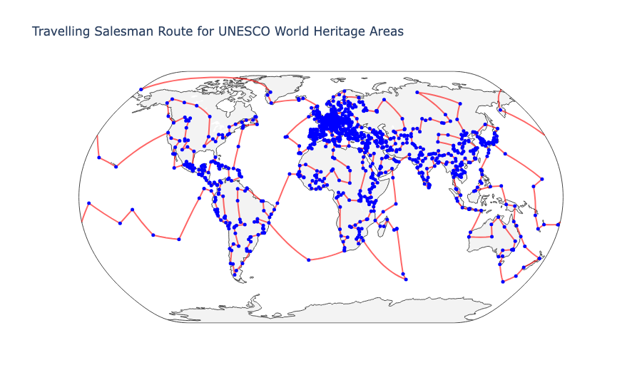

{
    "title": "Can you travel to all of the UNESCO World Heritage List sites in a single year?",
    "description": "Can you travel to all of the UNESCO World Heritage List sites in a single year?",
    "date": "2024-09-15",
    "params" : {
        "subtitle": "Probably not",
        "headerImageFile": "image.png",
        "headerImageCaption": "A futuristic style map"
    }
}

A friend who loves to travel posed an interesting question - would it be possible to visit all of the UNESCO World Heritage Sites in a single year. This had the potential to be a fun coding exercise, so I set to work.

First, we need to load data about all of the sites on the World Heritage List including their precise locations. Fortunately this data is provided on the UNESCO website in a number of formats including XML.


```python {linenos=inline}
import pandas as pd

# Load the data
url = 'https://whc.unesco.org/en/list/xml'
data = pd.read_xml(url)

# Extract relevant columns (latitude and longitude) and drop rows with missing values
locations = data[['site', 'latitude', 'longitude']].dropna()
locations.head()
```
```text
|   | site                                                                 | latitude   | longitude  |
|---|----------------------------------------------------------------------|------------|------------|
| 0 | Ancient and Primeval Beech Forests of the Carpathians                | 48.900000  | 22.183333  |
| 1 | Natural and Cultural Heritage of the Ohrid region                    | 40.991833  | 20.704167  |
| 2 | The Architectural Work of Le Corbusier, an Outstanding Contribution  | 46.468414  | 6.829336   |
| 3 | Qhapaq Ñan, Andean Road System                                       | -18.250000 | -69.591667 |
| 4 | Jesuit Missions of the Guaranis: San Ignacio Mini                    | -28.543333 | -54.265833 |
    ...
```

Now we need to calculate the distance between every pair of locations. The geodesic distance algorithm used by GeoPy is Karney's Algorithm (see <https://geopy.readthedocs.io/en/stable/#module-geopy.distance>). This is the state-of-the-art method for calculating geodesic distances. It uses an ellipsoidal model of the Earth, as the Earth is not a perfect sphere, and is accurate to 0.5mm. 

Using Karney's Algorithm is fairly computationally expensive. The [Haversine Formula](https://en.wikipedia.org/wiki/Haversine_formula) which uses great-circle distance (assuming a perfect sphere) could be calculated much faster. This is at the expense of accuracy though - given the Earth is not a perfect sphere, the Haversine Formula is less accurate, particularly over larger distances.

Also, this is supposed to be a quick and dirty script so let's not spend too much time optimising and roll with it. The performance isn't too bad - for the 1222 sites at the time of writing, the distances take a little over a minute and a half to calculate on my Macbook Pro.

```python {linenos=inline}
from geopy.distance import geodesic
import numpy as np

# Calculate distances between all pairs of locations

num_sites = len(locations)
distances = np.zeros((num_sites, num_sites))

def calculate_distance(lat1, lon1, lat2, lon2):
    return geodesic((lat1, lon1), (lat2, lon2)).kilometers

for i in range(num_sites):
    for j in range(i+1 , num_sites):
        dist = calculate_distance(
            locations.iloc[i]['latitude'], locations.iloc[i]['longitude'],
            locations.iloc[j]['latitude'], locations.iloc[j]['longitude']
        )
        distances[i, j] = dist
        distances[j, i] = dist
```

With the distances in hand, we now need to calculate the shortest route that can be used to visit all of the sites. Our work so far has been to create an undirected weighted graph, where the sites are the vertices and the distances between each are the edges. This is a classic [Travelling Salesman Problem](https://en.wikipedia.org/wiki/Travelling_salesman_problem). 

Google's [OR-Tools](https://developers.google.com/optimization) library provides a powerful set of tools for solving optimisiation problems, including travelling salesman problems (see <https://developers.google.com/optimization/routing/tsp>), so we'll use that.

Given the Travelling salesman problem is an NP-Hard problem, it's not feasible to find an exact optimal solution. For this reason, we'll let OR-Tools run for 20 minutes, getting the best route it can find in that amount of time.


```python {linenos=inline}
from ortools.constraint_solver import routing_enums_pb2
from ortools.constraint_solver import pywrapcp

# Use ortools to solve the TSP
def create_data_model():
    data = {}
    data['distance_matrix'] = distances
    data['num_vehicles'] = 1
    data['depot'] = 0
    return data

def distance_callback(from_index, to_index):
    from_node = manager.IndexToNode(from_index)
    to_node = manager.IndexToNode(to_index)
    distance = data['distance_matrix'][from_node][to_node] 
    return int(distance * 1000)  # Convert to meters for integer precision

data = create_data_model()
manager = pywrapcp.RoutingIndexManager(len(data['distance_matrix']), data['num_vehicles'], data['depot'])
routing = pywrapcp.RoutingModel(manager)

transit_callback_index = routing.RegisterTransitCallback(distance_callback)

routing.SetArcCostEvaluatorOfAllVehicles(transit_callback_index)
search_parameters = pywrapcp.DefaultRoutingSearchParameters()
search_parameters.first_solution_strategy = (routing_enums_pb2.FirstSolutionStrategy.PATH_CHEAPEST_ARC)
search_parameters.local_search_metaheuristic = (routing_enums_pb2.LocalSearchMetaheuristic.GUIDED_LOCAL_SEARCH)
search_parameters.time_limit.seconds = 1200 # Limit run time to 20 minutes
search_parameters.log_search = True
solution = routing.SolveWithParameters(search_parameters)
if solution:
    print("Solution found")
else:
    print("No solution")
```
```text
    WARNING: All log messages before absl::InitializeLog() is called are written to STDERR
    I0000 00:00:1726356831.868001 19195760 search.cc:285] Start search (memory used = 181.50 MB)
    I0000 00:00:1726356831.868867 19195760 search.cc:285] Root node processed (time = 0 ms, constraints = 4896, memory used = 181.55 MB)
    I0000 00:00:1726356832.230843 19195760 search.cc:285] Solution #0 (385667086, time = 362 ms, branches = 34, failures = 1, depth = 33, memory used = 181.84 MB, limit = 0%)
    I0000 00:00:1726356832.858644 19195760 search.cc:285] Solution #1 (385666315, maximum = 385667086, time = 990 ms, branches = 38, failures = 3, depth = 33, LinKernighan, neighbors = 1, filtered neighbors = 1, accepted neighbors = 1, memory used = 182.30 MB, limit = 0%)
    I0000 00:00:1726356832.861530 19195760 search.cc:285] Solution #2 (385660408, maximum = 385667086, time = 993 ms, branches = 43, failures = 5, depth = 33, LinKernighan, neighbors = 2, filtered neighbors = 2, accepted neighbors = 2, memory used = 182.30 MB, limit = 0%)
    I0000 00:00:1726356832.864627 19195760 search.cc:285] Solution #3 (385367374, maximum = 385667086, time = 996 ms, branches = 47, failures = 7, depth = 33, LinKernighan, neighbors = 3, filtered neighbors = 3, accepted neighbors = 3, memory used = 182.30 MB, limit = 0%)
    I0000 00:00:1726356832.867504 19195760 search.cc:285] Solution #4 (385362083, maximum = 385667086, time = 999 ms, branches = 53, failures = 9, depth = 33, LinKernighan, neighbors = 4, filtered neighbors = 4, accepted neighbors = 4, memory used = 182.30 MB, limit = 0%)
    I0000 00:00:1726356832.870188 19195760 search.cc:285] Solution #5 (385361133, maximum = 385667086, time = 1002 ms, branches = 57, failures = 11, depth = 33, LinKernighan, neighbors = 5, filtered neighbors = 5, accepted neighbors = 5, memory used = 182.30 MB, limit = 0%)
    ...
    <truncated>
    ...
    I0000 00:00:1726358023.336095 19195760 search.cc:285] Solution #904 (333263808, minimum = 333032777, maximum = 385667086, time = 1191468 ms, branches = 4792, failures = 1992, depth = 33, TwoOpt, neighbors = 640363987, filtered neighbors = 904, accepted neighbors = 904, memory used = 185.86 MB, limit = 99%)
    I0000 00:00:1726358025.805534 19195760 search.cc:285] Solution #905 (333262950, minimum = 333032777, maximum = 385667086, time = 1193937 ms, branches = 4797, failures = 1994, depth = 33, TwoOpt, neighbors = 640677511, filtered neighbors = 905, accepted neighbors = 905, memory used = 185.86 MB, limit = 99%)
    I0000 00:00:1726358025.816194 19195760 search.cc:285] Solution #906 (333218765, minimum = 333032777, maximum = 385667086, time = 1193948 ms, branches = 4801, failures = 1996, depth = 33, TwoOpt, neighbors = 640677513, filtered neighbors = 906, accepted neighbors = 906, memory used = 185.86 MB, limit = 99%)
    I0000 00:00:1726358030.377125 19195760 search.cc:285] Solution #907 (333190777, minimum = 333032777, maximum = 385667086, time = 1198509 ms, branches = 4808, failures = 1998, depth = 33, OrOpt<1>, neighbors = 641423529, filtered neighbors = 907, accepted neighbors = 907, memory used = 185.86 MB, limit = 99%)


    Solution found


    I0000 00:00:1726358031.861175 19195760 search.cc:285] Finished search tree (time = 1199993 ms, branches = 4811, failures = 2029, neighbors = 642689146, filtered neighbors = 907, accepted neigbors = 907, memory used = 185.86 MB)
    I0000 00:00:1726358031.861709 19195760 search.cc:285] End search (time = 1199993 ms, branches = 4811, failures = 2029, memory used = 185.88 MB, speed = 4 branches/s)
```

Ok great, we have an approximate solution. Now let's extract the route from the solution and calculate the total distance.


```python {linenos=inline}
# Extract the route from the solution and calculate the total distance
route = []
total_distance_metres = 0

index = routing.Start(0)
while not routing.IsEnd(index):
    route.append((locations.iloc[manager.IndexToNode(index)]['latitude'], locations.iloc[manager.IndexToNode(index)]['longitude']))
    previous_index = index
    index = solution.Value(routing.NextVar(index))
    distance_segment = routing.GetArcCostForVehicle(previous_index, index, 0)
    total_distance_metres += distance_segment
route.append((locations.iloc[manager.IndexToNode(index)]['latitude'], locations.iloc[manager.IndexToNode(index)]['longitude']))

total_distance_km = total_distance_metres / 1000
print(f"Total distance: {total_distance_km:.2f} km")
```

```text
    Total distance: 333032.78 km
```

333032 kilometres is a long way - that's over 8 times around the globe.

Ok, one of my main aims with this exercise was to generate a pretty-looking map visualisation. We'll use the [Plotly](https://plotly.com/python/maps/) library for this which generates beautiful map visualisations.


```python {linenos=inline}
import plotly.graph_objects as go

# Extract latitude and longitude from the route
route_latitudes = [point[0] for point in route]
route_longitudes = [point[1] for point in route]

# Create a scatter plot for the locations
scatter = go.Scattergeo(
    locationmode='ISO-3',
    lon=locations['longitude'],
    lat=locations['latitude'],
    hoverinfo='text',
    text=locations['site'],
    mode='markers',
    marker=dict(
        size=5,
        color='blue',
        line=dict(width=1, color='rgba(68, 68, 68, 0)')
    )
)

# Create a line plot for the route
route_line = go.Scattergeo(
    locationmode='ISO-3',
    lon=route_longitudes,
    lat=route_latitudes,
    mode='lines',
    line=dict(width=2, color='red'),
    opacity=0.6,
    hoverinfo='none'
)

# Create the layout for the map
layout = go.Layout(
    title='Travelling Salesman Route for UNESCO World Heritage Areas',
    showlegend=False,
    geo=dict(
        scope='world',
        projection=dict(type='natural earth'),
        #projection=dict(type='orthographic'),
        showland=True,
        landcolor='rgb(243, 243, 243)',
        subunitwidth=1,
        countrywidth=1,
        subunitcolor='rgb(217, 217, 217)',
        countrycolor='rgb(217, 217, 217)',

    ),
    autosize=True,
    width=900,
    height=533
)

# Create the figure and display it
fig = go.Figure(data=[route_line, scatter], layout=layout)
fig.show()

```



Looks great! From the map and total distance, my gut feeling is that it isn't feasible to do in the space of one year. Let's try validating that with some back-of-the-envelope calculations.

Let's assume you need seven hours of sleep per night, and another three hours per day for meals and other miscellaneous activities. Let's also assume that you want to spend a minimum of three hours at each site to take it in - this doesn't seem like enough, but would be the bare minimum. Travel time is a difficult one. Commercial passenger jets cruise at speeds of around 950 km/h, surface-based transport is much slower than this of course. Let's assume an average travel time of 200 km/h, this still seems high but we have to make do.

```python {linenos=inline}
# Assume 7 hours of sleep per night:
sleep_time = 7 * 365

# Assume 3 hours a day for meals and other miscellaneous activities:
meals_and_misc_time = 3 * 365

# Assume 3 hours spent per site:
visit_time = 3 * num_sites

# Assume travel of 200 km per hour:
travel_time = total_distance_km / 200

total_time = (sleep_time + meals_and_misc_time + visit_time + travel_time) / 24

print(f"Total time required: {total_time:.2f} days")

```
```text
    Total time required: 374.22 days
```

So there you have it. It would take over a year, and that's if you're someone with the resources to travel extremely quickly between destinations, and not spend much time at each one. Even then, doing it this way doesn't sound like much fun. For us mere mortals, this would take even longer as realistic forms of travel are rarely point-to-point as in our model, and waiting for flights/trains, clearing customs and immigration etc. would eat up even more time.

A more realistic goal would be to go on a trip where you can visit as many sites as possible. As you can easily see from the map, Europe is the standout option here, especially when you consider transport infrastructure and the ease of travel through the Schengen Area. In fact the World Heritage List has been [criticised](https://theconversation.com/world-heritage-site-selection-is-eurocentric-and-that-shapes-which-historic-places-get-love-and-money-115898) for being overly Eurocentric. The Middle East and parts of Asia are also good options.

The Juypter notebook I used to generate this is available [here](https://gist.github.com/chrisflemming/7738adebca03a50476cd8da58e719723) as a GitHub Gist.