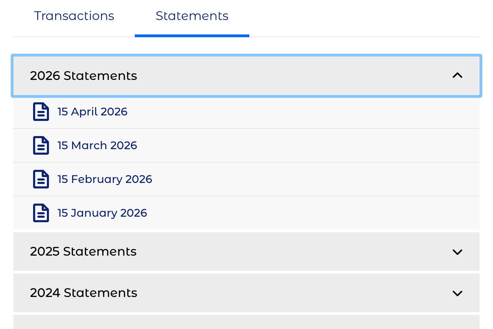
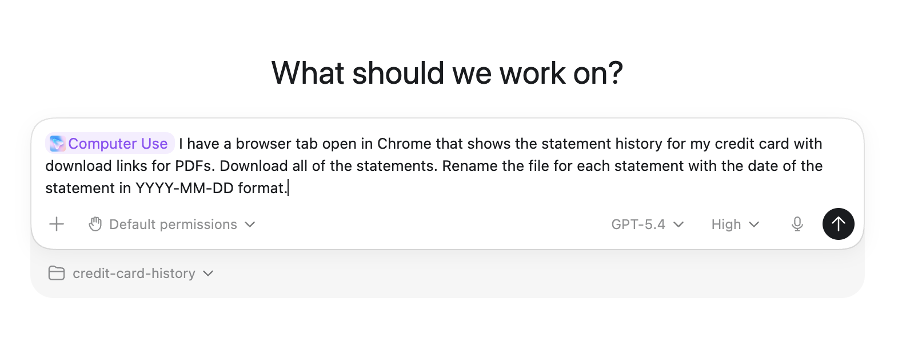
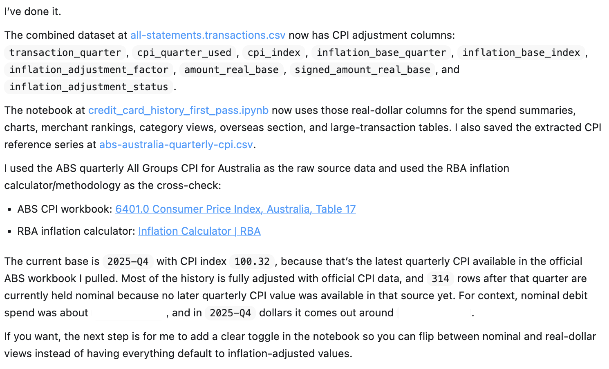
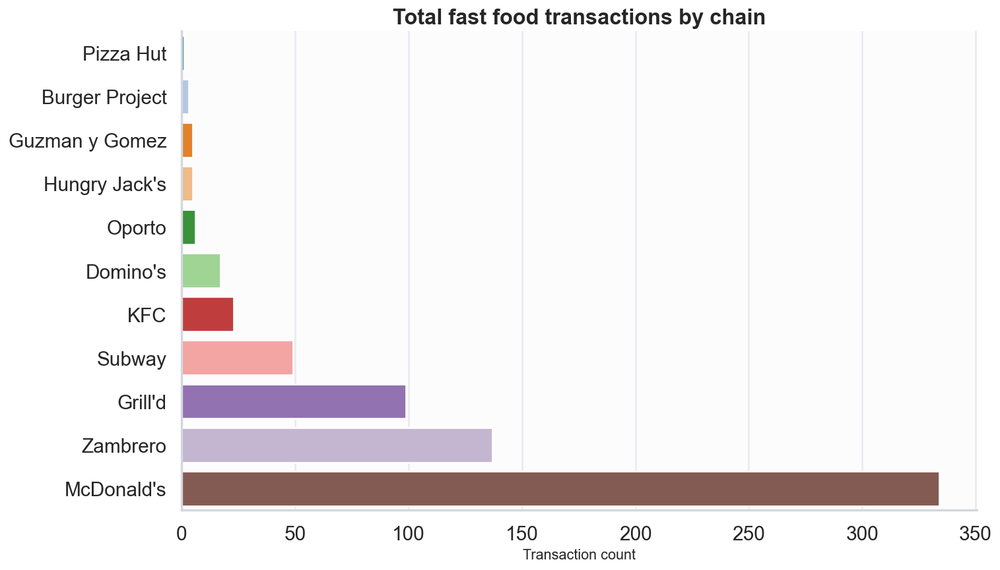
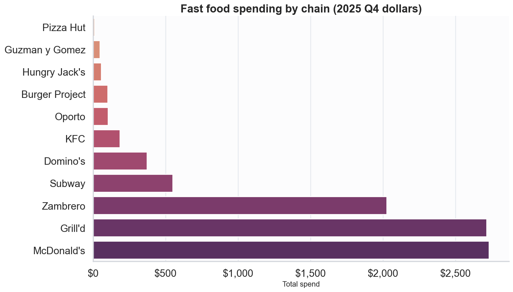
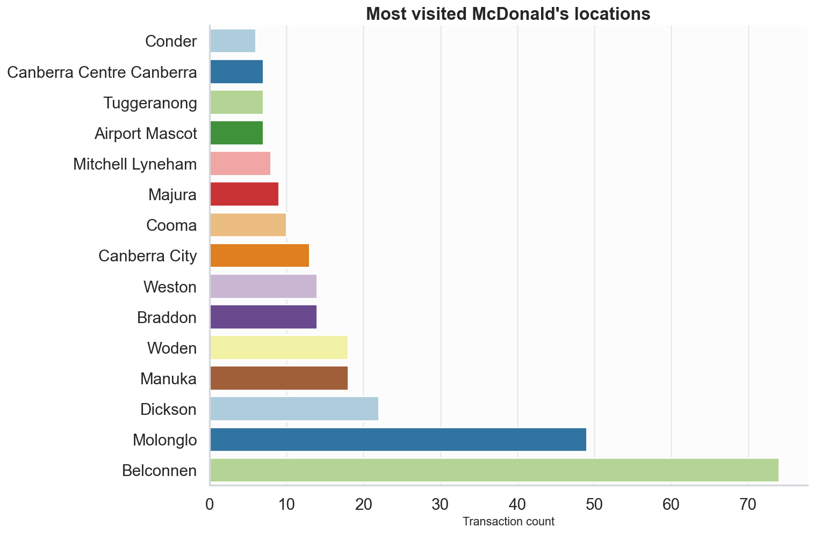
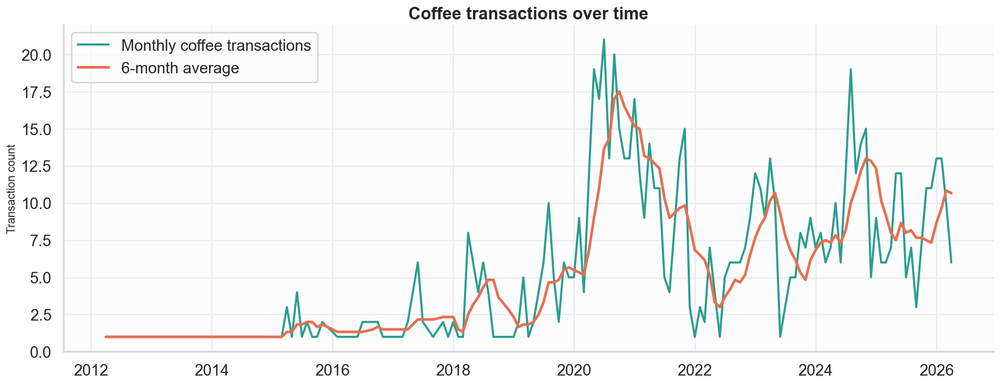

{
    "title": "I analysed seventeen years of fast food and coffee spending using OpenAI Codex",
    "description": "Analysis of credit card history using OpenAI Codex",
    "date": "2026-04-21",
    "params" : {
        "subtitle": "There was a clear winner",
        "headerImageFile": "image.png",
        "headerImageCaption": "Editorial collage of bank statements, charts, coffee, and fast food around an analysis dashboard"
    }
}

I've only ever had the one credit card. When I log into the online portal for my account I can see statements back to 2009. I'd always wanted to do something with that data but never found the time. When the latest update to Codex with computer use dropped over the weekend I knew it was time.

The online portal for my credit card listed 200 statements with links to the associated PDFs. That's a lot of links to click. No one has time for that.

After clicking a few links "manually" using computer use, Codex decided it would be more efficient to use AppleScript to automate navigating the page. After a few hiccups due to Apple Events not being enabled in Chrome, we were on our way.

Codex was able to parse the PDFs to extract the transaction information into a single CSV file. It was able to handle multiple changes in the format of the statements over the years.

I then asked Codex to use the CSV data to create a Jupyter notebook containing analysis and visualisations. We had some back-and-forth to resolve some Python environment issues but it did all the analysis without me needing to write any code. I was particularly impressed with the way it categorised purchases based on the transaction description. It correctly categorised a number of local businesses.

It was fun chatting with Codex about the data and asking it to add or enhance notebook sections. At one point it occurred to me that seventeen years is a long time so the dollar amounts should be adjusted for inflation. Codex fetched the required data from the Reserve Bank of Australia and did that without missing a beat.

So what were the results?

### Fast Food

That's a lot of fast food. And there was a clear winner. It's not too bad over seventeen years though, right?

This chart shows how much more expensive Grill'd is in comparison to McDonalds.

One particular McDonald's store won out over all the others too.

### Coffee

This is an interesting chart. The first big peak in coffee transactions occurred during the COVID pandemic. I was working from home at that time. There were restrictions in place in Canberra at that time but a full lockdown wasn't in effect. Going out for takeaway coffee was one of the few things I could do to get out of the house. The later peak coincides with a good cafe opening up within walking distance of my house.

### Give it a go
This was a fun way to try out the latest in AI tooling, and it provided some interesting insights. I recommend giving it a try yourself.
